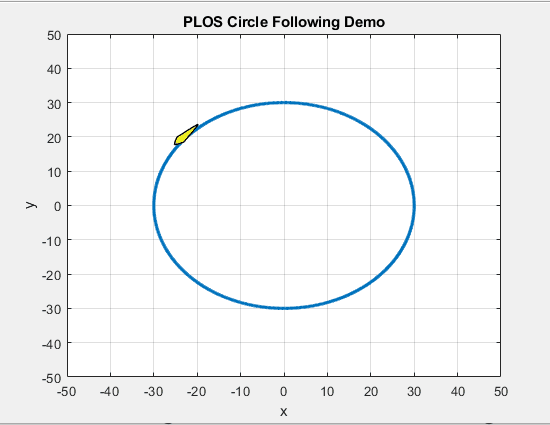

# unmanned_surface_vehicles_path_following_algorithms
Four path following algorithms, including Carros Chasing algorithm, Nonlinear Guidance Law, Vector Field algorithm and Pure Pursuit and LOS algorithm, are developed for unmanned surface vehicle to follow a path precisely. For more details, please refer to my paper:  [Efficient Path Following Algorithm for Unmanned](https://ieeexplore.ieee.org/abstract/document/7485430)

These algorithms are tested for following stright line or circle. For example, you can run PLOS_straight_line.m or PLOS_circle.m file to make the usv follow the pre-defined path.

